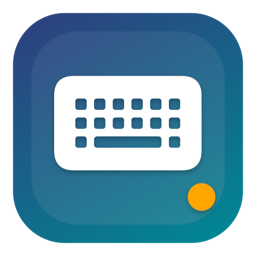

# BTS Key

MacBook을 iMac의 **블루투스 키보드·트랙패드**로 만드는 macOS 메뉴바 앱입니다. iMac에는 아무것도 설치하지 않습니다. 관리자 권한이 없는 관리형 iMac에서도 블루투스 페어링만으로 동작합니다.

<p align="center"></p>
<p align="center"><a href="https://newids.github.io/bts-key-imac/">웹사이트</a> · <a href="https://github.com/newids/bts-key-imac/releases/latest">다운로드</a></p>

## 무엇을 하나

- **키보드 전달** — MacBook에서 치는 키가 iMac으로 갑니다. Caps Lock은 iMac의 🌐(입력 소스 전환) 키로 바뀌어 한/영 전환이 됩니다. 원하면 ⌃스페이스나 Caps Lock 그대로로 바꿀 수 있습니다.
- **트랙패드 전달** — 이동·클릭·두 손가락 스크롤을 iMac의 마우스로 전달합니다. 포인터 배율을 1×~4×로 조절합니다.
- **한 번에 전환** — `⌥⌘K`로 MacBook 입력과 iMac 입력을 오갑니다. iMac 입력 중에는 메뉴바 아래에 주황색 상자가 떠 있고, MacBook 포인터는 제자리에 숨겨집니다.
- **알아서 다시 연결** — iMac이 잠자기에서 깨면 다시 붙고, 쓰던 중이었다면 iMac 입력으로 자동 복귀합니다. 로그인 화면에서 바로 암호를 칠 수 있습니다.
- **절전** — iMac 입력 중에는 MacBook 화면을 어둡게 하거나 끕니다.
- **기기 목록** — 연결한 적 있는 iMac이 메뉴에 아이콘·이름으로 남고, 이름을 누르면 바로 연결됩니다.

## 설치

**요구 사항**: macOS 13 Ventura 이상(Apple 실리콘·Intel), 블루투스. iMac 쪽은 macOS 10.x 이상 어느 버전이든 됩니다.

1. [Releases](https://github.com/newids/bts-key-imac/releases)에서 `BTSKey-<버전>.dmg`를 내려받습니다.
2. DMG를 열고 **BTS Key**를 **Applications**로 끌어 놓습니다.
3. 응용 프로그램에서 BTS Key를 실행합니다. **"확인되지 않은 개발자" 경고가 뜨면** 아이콘을 control-클릭(오른쪽 클릭) → **열기** → **열기**를 누릅니다. 이 앱은 Apple 개발자 인증서로 서명·공증되지 않았기 때문에 처음 한 번만 이 절차가 필요합니다.
4. 첫 실행 안내가 뜹니다. 안내를 따라 Bluetooth·손쉬운 사용·입력 모니터링 권한을 허용하고, iMac과 페어링합니다.

## 사용

1. **페어링(처음 한 번)** — iMac의 시스템 설정 → Bluetooth에서 이 MacBook을 페어링합니다.
2. **연결** — iMac의 Bluetooth 설정에서 "BTS Key" 옆 **연결**을 누르거나, MacBook 메뉴바의 키보드 아이콘 → iMac 이름을 누릅니다.
3. **전환** — `⌥⌘K`. 같은 키로 돌아옵니다. 화면 잠금·잠자기·연결 끊김 때는 자동으로 MacBook 입력으로 돌아옵니다.

메뉴 항목과 설정은 [docs/usage.md](docs/usage.md)에 자세히 있습니다. 문제가 생기면 메뉴 → 도움말 → **진단 로그 내보내기**로 만든 파일을 첨부해 [이슈](https://github.com/newids/bts-key-imac/issues)를 남겨 주세요.

## 동작 원리

MacBook이 Bluetooth Classic HID(키보드+마우스 조합 장치)를 흉내 냅니다. IOBluetooth로 SDP 레코드를 게시하고, iMac이 결합된 키보드에 하는 것처럼 L2CAP 제어·인터럽트 채널을 열어 오면 받아들입니다. 키 입력은 CGEvent 탭으로 가로채 USB HID 리포트로 바꿔 인터럽트 채널로 보냅니다. 왜 이 설계인지, 무엇을 시험해 봤는지는 [docs/analysis-and-design.md](docs/analysis-and-design.md)와 [docs/connection-audit.md](docs/connection-audit.md)에 있습니다.

## 개발

```bash
swift build && swift test          # 라이브러리 빌드와 단위 테스트
./scripts/build-app.sh             # build/BTSKey.app (ad-hoc 서명)
./scripts/build-dmg.sh             # build/BTSKey-<버전>.dmg + SHA-256
```

- `Sources/HIDCore` — 리포트 디스크립터, 키보드·마우스 리포트 인코딩, 키코드 매핑, 세션 상태 머신, 연결 이력. 순수 Swift라 단위 테스트가 여기에 몰려 있습니다.
- `Sources/ClassicHIDTransport` — IOBluetooth 기반 Bluetooth Classic HID 장치 에뮬레이션.
- `Sources/InputCapture` — CGEvent 탭, Caps Lock 모니터, 커서 잠금, 단축키.
- `Sources/BTSKeyApp` — 메뉴바 앱, 첫 실행 안내, 절전, 지원 기능.

배포 절차(서명·공증 포함)는 [docs/distribution.md](docs/distribution.md)에 있습니다.

## 작업 내역

| 날짜 | 내용 |
|---|---|
| 2026-09-23 | 요구 분석·설계. 기존 제품(KeyPad) 분석으로 Classic HID 경로 확정. HIDCore·전송·입력 캡처·메뉴바 앱 첫 구현. |
| 2026-09-23 | 연결 과정 1차 감사: SDP 재게시 실패, 고정 간격 재시도, 인바운드 미수락 수정. |
| 2026-09-26 | 2·3차 감사: 자리 이동 시 새 iMac 자동 채택, IOBluetooth 메인 스레드 정지 해결, 끊김 즉시 감지. Caps Lock 한/영, 포인터 고정·숨김, 상시 상태 상자, 절전, 단축키 ⌥⌘K. 🌐 키 지원. |
| 2026-09-26 | 4차 감사: iMac이 먼저 여는 연결의 요청 응답 누락 수정, 낡은 링크 초기화, SDP 게시 재시도, 잠자기 복귀 시 iMac 입력 자동 복귀. |
| 2026-09-27 | 배포 패키징(아이콘·DMG·서명/공증 훅·로그인 시 자동 실행), 첫 실행 안내, About/도움말/지원 메뉴, 기기 목록. v0.1.0. |
| 2026-09-27 | v0.1.1: 연결 시도 중 앱이 멈추면 MacBook 전체 입력이 멈추던 문제 수정(이벤트 탭을 전용 스레드로 분리), 채널 열기 전 링크 상태 대기, 자동 재시도 5회 제한. |

## 알려진 제한

- 트랙패드는 iMac에 마우스로 보입니다. 핀치·세 손가락 스와이프 같은 멀티터치 제스처는 전달되지 않습니다.
- MacBook의 fn 키 조합(밝기·음량 등)은 전달되지 않습니다.
- Apple 개발자 인증서가 없어 첫 실행 때 Gatekeeper 경고가 뜹니다.

## 라이선스

MIT
